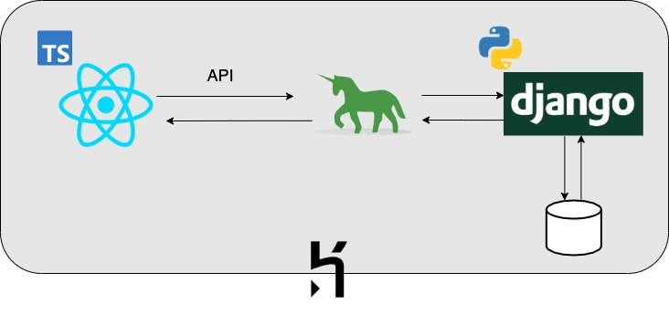

# Lunch Link Learning

[Let's go for lunch!](https://salty-scrubland-05174.herokuapp.com/register)（ユーザ登録）

<!--  -->

## 製品概要
- ぼっちご飯したくない、友だちを作りたい、情報交換をしたい、という大学生や大学教員向けの、大学の学食などで一緒に食事することができるマッチングアプリ。

### 背景(製品開発のきっかけ、課題等）
#### ターゲット
- 大学生、大学教員

#### ターゲットが抱える課題
- 大学生：コロナ禍の影響もあり友だちができない（特に新入生）、人とのつながりが少ない、授業やサークルなどの情報が欲しい、研究について詳しく知りたい。
- 大学教員：学生と話したい（イメージ）、意欲のある優秀な学生が欲しい。
- 大学の食堂：利用者が減っている。
- 誰かとご飯を食べたい。

### 製品説明（具体的な製品の説明）
### 特長
#### 1. プロフィール
所属大学や研究、ポジションをプロフィールに登録することで、様々な人と出会える。
#### 2. 募集作成
タイトルや日時、場所、タグなどをつけて募集を作成することができます。
#### 3. 承認・拒否
自分の作成した募集に申請がきた場合、相手のプロフィールを見て承認するか拒否するか選択することができます。

### 解決出来ること
- 大学生：横の繋がりが増えることで、情報交換を行える。違う学年、違う大学の人と繋がることができる。研究について知ることで、研究室選びの参考になる。
- 大学教員：学生の現状を知ることができる。優秀な学生と早めに出会える。学生に自分の研究を知ってもらえる。
- 大学の食堂：利用者が増える。

### 今後の展望
- 拒否された相手に何度も申請を遅れないようにする。
- チャット機能を実装する。
- 検索機能をより充実させる．

### 注力したこと（こだわり等）
* 
* 

## 開発技術

### 活用した技術
#### フロントエンド 
- React、TypeScript

#### バックエンド
- Django、Python

#### インフラ、DB
- Heroku
- Heroku Postgres

### 独自技術
#### ハッカソンで開発した独自機能・技術
* 独自で開発したものの内容をこちらに記載してください
* 特に力を入れた部分をファイルリンク、またはcommit_idを記載してください。

#### 製品に取り入れた研究内容（データ・ソフトウェアなど）（※アカデミック部門の場合のみ提出必須）
* 
* 
